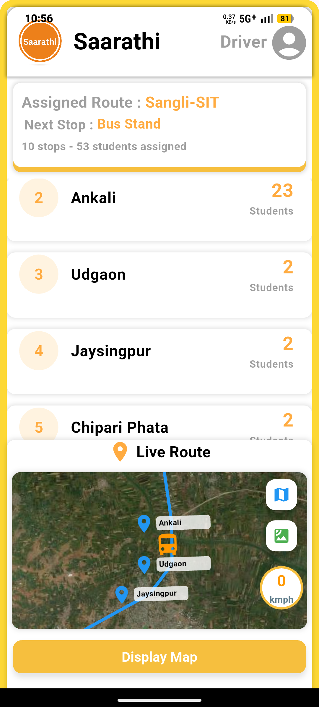
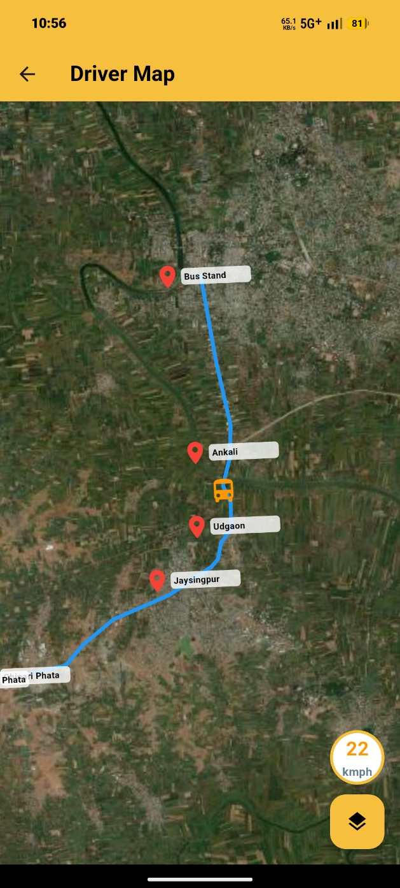
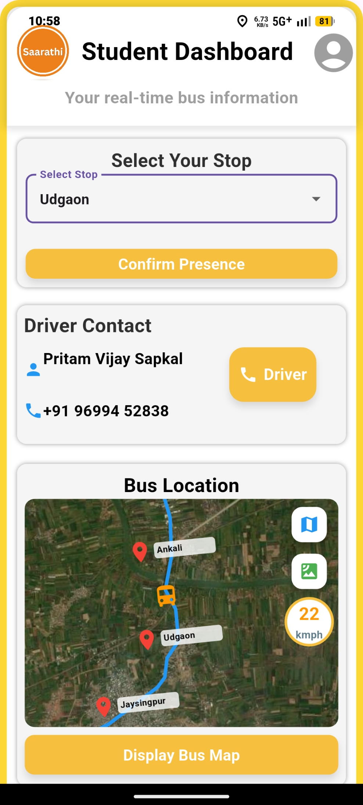
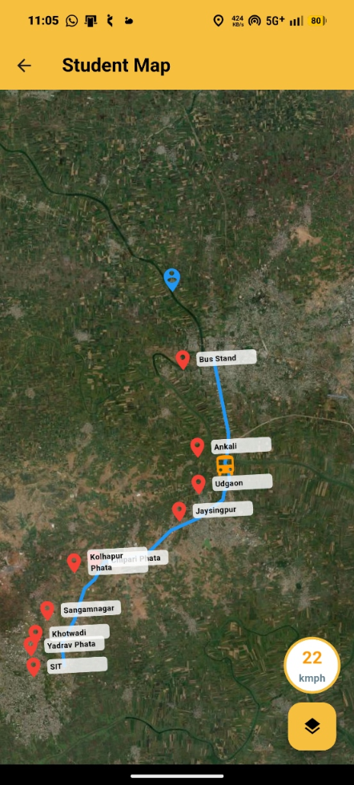

<div align="center">

# 🚌 Saarathi — Smart College Bus Tracking System

<p align="center">
  <strong>A real-time transit logistics & navigation mobile system bridging the gap between college drivers and students.</strong>
</p>

<p align="center">
  
  
  
  
  
</p>

<p align="center">
  <a href="https://github.com/PritamSapkal/Sarrathi_Project/releases/download/Saarathi/Saarathi_V_1.0.3.apk">
    
  </a>
  <a href="https://github.com/PritamSapkal/Sarrathi_Project/releases">
    
  </a>
</p>

</div>

---

## 📌 Overview

**Saarathi** is a smart college bus tracking system built using Flutter and Firebase Cloud Firestore. It eliminates daily uncertainty for students waiting at stops by synchronizing drivers and student riders into a single unified tracking architecture. 

The application provides automated role-based navigation, live map coordinate streaming from the driver's device, predefined route checkpoints, and daily stop-wise student attendance reporting.

---

## 📱 Screenshots

<div align="center">

| Splash Screen | Driver Dashboard | Driver Map | Student Dashboard | Student Map |
| :---: | :---: | :---: | :---: | :---: |
|  |  |  |  |  |

</div>

---

## ✨ Key Features

### 🔐 1. Role-Based Authentication & Smart Routing
* **Admin-Provisioned Drivers:** Driver accounts cannot be self-registered; credentials are provisioned strictly through the Admin to verify authorized drivers.
* **Student Self-Registration:** Students can register and authenticate directly through the mobile application.
* **Dynamic Login Router:** The login system verifies credentials against the driver database in Cloud Firestore. If found, the user is navigated to the Driver Dashboard; otherwise, they are routed to the Student Dashboard.

### 📍 2. Real-Time Tracking & Route Filtering
* **Live GPS Broadcast:** Once a trip is initiated, the driver's device streams live latitude and longitude coordinates directly to Cloud Firestore.
* **Predefined Checkpoints:** Stop coordinates (latitude/longitude) stored in Firestore plot the entire route sequence from the starting point directly to the college campus.
* **Route-Specific Visibility:** Students only view their assigned route (e.g., Sangli or Jaysingpur). Students track their bus relative to local landmarks and designated stops.

### 📋 3. Daily Stop-Wise Attendance Counter
* **One-Tap Mark Present:** Students mark their daily attendance inside the app before boarding.
* **Driver Manifest Dashboard:** Drivers see real-time student counts boarding at each specific stop along the route, alongside the total number of students attending for the day.
* **Daily Auto-Reset:** Attendance counters reset daily in the database to ensure clean, updated passenger counts for every morning run.

---

## 🛠️ Tech Stack

| Layer | Technology | Details |
|---|---|---|
| **Framework** | Flutter (Dart) | Cross-platform responsive mobile UI |
| **Database** | Firebase Cloud Firestore | Low-latency live coordinate updates & route configurations |
| **Authentication** | Firebase Auth | Secure role-based user management |
| **Location & Maps** | Geolocator & Map Layer | Device GPS streaming and dynamic route stop plotting |

---

## 📥 Download & Installation

1. Download the latest production APK directly:
   * **[Saarathi_V_1.0.3.apk](https://github.com/PritamSapkal/Sarrathi_Project/releases/download/Saarathi/Saarathi_V_1.0.3.apk)**
2. Or browse previous releases on the **[GitHub Releases Page](https://github.com/PritamSapkal/Sarrathi_Project/releases)**.
3. Install the APK on your Android device (ensure *Install from Unknown Sources* is enabled in device settings).

---

## 🚀 Getting Started (For Development)

### Prerequisites
* Flutter SDK (`>= 3.0.0`)
* Dart SDK
* Android Studio / VS Code
* Configured `google-services.json` in `android/app/`

### Clone & Run
```bash
# Clone the repository
git clone [https://github.com/PritamSapkal/Sarrathi_Project.git](https://github.com/PritamSapkal/Sarrathi_Project.git)

# Navigate to project directory
cd Sarrathi_Project

# Fetch dependencies
flutter pub get

# Run the app
flutter run